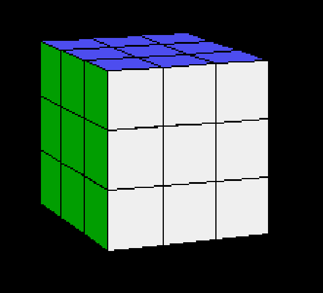

The Rubik's cube was one of my favorite toys as a child, and writing an animated 3D cube was my dream project at the age of 18. 

This repo shows the result of that effort.



Online demo [here](https://csokavar.hu/projects/rubik).

The code was written in Borland C++ (mostly C) using an old 5x86 machine. 

I found the archives in 2021 and made it available in DOSBox. 

# Developing, building, playing around

I use a mac these days, so the scripts work on the mac only... You need to have node and npm installed. 
If you want to play with the source code, put [dosbox.app](https://www.dosbox.com/) in the root of the repository.

```
- npm run build:     creates a rubik.zip file in the public folder.
- npm run dosbox:    opens DOSBox with Borland C++ and Norton Commander installed.
```

To build rubik.exe:
```
- start DOSBox
- start the IDE with "BC" in C:\
- open C:\RUBIK\RUBIK.PRJ
- build with F9
``` 

You need to exit the IDE and run the .exe from the BIN directory.

**Whatever** is in the src directory, it doesn't reflect the author's 
view of professional software development. It's more like a
junior's desperate effort to create something moderately complicated.

Hey, all of us had to start somewhere...

**Copyright**: I know that I shouldn't... but the whole devenv is checked in
with the source code. How on Earth am I supposed to find the Borland C++ 
compiler 10 years from now afterall? And the same goes for Norton Commander...
That's how things were working in 1998, let's just conserve it for the future.
